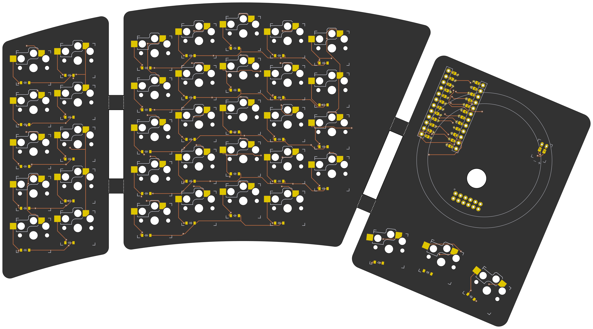
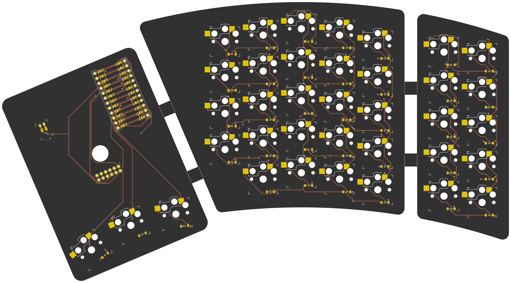

# The Happy Camper
A mechanical keyboard that has built in tenting

## Layout
* Physical layout is declared by me using [Ergogen](https://github.com/mrzealot/ergogen/)'s syntax.
* The build system runs Ergogen to translate YAML to a KiCad PCB and plate files for FR-4 fab or laser cutting
* The build system then uses [kicad-automation-scripts](https://github.com/productize/kicad-automation-scripts) and [FreeRouting](https://github.com/freerouting/freerouting) to **automatically route the traces on the PCB**
* Lastly, the build system uses [KiKit](https://github.com/yaqwsx/KiKit) to render PCB previews (see pictures below) and production-ready **Gerber files**

### Front

### Back

## Features and Design Considerations
- Thin to avoid the need for a wrist rest
- Choc switches because there are a lot of options. Low profile Gateron switches were considered, but they're too new and the surrounding ecosystem is still growing
- Hot swap sockets because the flex PCB is not something you want to resolder
- Flex PCB to accommodate the connections across the constant torque/friction hinges
- Reversible to cut down on costs; Flex PCB is not cheap
- Battery is located in the modules to keep the keyboard itself thin.

## Development
To install node modules to get your environment ready, run:  
`make setup`

To generate Gerbers, case STLs, and images with the PCB already routed for you  
`make clean all`

If you need to iterate more quickly, `preview` will skip the routing step  
`make clean preview` 

### Firmware
TBD, probably ZMK for wireless, but pointing devices are still under development
